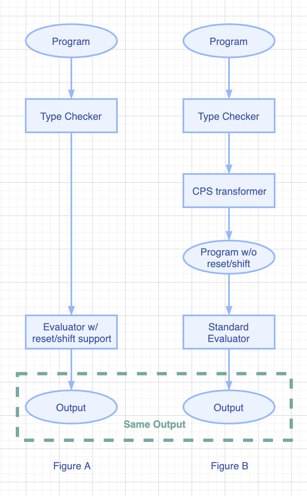

# Typed Delimited Continuation

Project on the Design Principles of Programming Languages (2020) at Peking University.

[toc]

## Work Division

We have spent nearly three months to complete and polish this project. We have rewritten most of the codes provided by [TAPL](https://www.cis.upenn.edu/~bcpierce/tapl/) [9], including 2500+ line additions and 1200+ line deletions. During the process of development, we read several interesting papers and learnt a lot from them.

+ Renze Chen: Frontend
  + Syntax/Parsing
  + Type Inference
+ Chengke Wang: Backend
  + CPS Transformation
  + Evaluation


## Synopsis

More examples can be found in `/examples` directory. 

```
/* Output: 3 */ 
succ succ succ 0;


/* skip over the first two `succ` */
/* Output: 1 */
succ succ (shift k in succ 0); 


/* skip over the second `succ` */
/* Output: 2 */
succ (reset succ (shift k in succ 0)); 
/*
succ_1 ...   | [ null, null  ]
reset ...    | [ succ_1, null ]
succ_2 ...   | [ null, succ_1 ]
shift  ...   | [ succ_2, succ_1 ]
succ_3 ...   | [ null, succ_1]
1            | [ null, succ_1]
succ_1 1     | [ null, null ]
2
*/

/* resume the captured continuation */
/* Output: 3 */
succ (shift k in k (k (k 0)));


/* type modification: from Nat to Bool */
/* Output 1 */
if (reset succ (shift k in true)) then 1 else 2;
/*
if ...                 | [ null,  null ]
reset (...)            | [ if..., null ]
succ (shift k in true) | [ null, if... ]
shift k in true        | [ succ, if... ]
true                   | [ null, if... ]
if true ...            | [ null, null  ]
1                      | [ null, null  ]
*/

/* Nondeterministic programming */ 
let (+) = fix add. a b. 
  if iszero a 
  then b
  else add (pred a) (succ b)
in let (*) = fix mul. a b.
  if iszero a 
  then 0 
  else b + (mul (pred a) b)
in let append = fix append. l1 l2.
  lmatch l1 {
    case nil => l2 
    case hd :: tl => hd :: append tl l2
  }
in let choose = lambda l. shift k in (fix choose. l k.
  lmatch l {
    case nil => []
    case hd :: tl => append (k hd) (choose tl k)
  } ) l k
in reset 
    let a = choose [1, 2] in 
    let b = choose [3, 4] in 
    [[a + b * a, a * b + a]];
```


## Build and Run

Suppose the input file is `test.f`. Run the following command to build and run the interpreter.

```bash
./run.sh test.f
```

The `make interface` target is for build `*.cmi` and `*.cmti` files. These files facilitate code completion and type inference in [Merlin](https://github.com/ocaml/merlin).


## Motivation

Delimited continuations were first introduced by Felleisen in 1988. It is a powerful tool for abstracting control. They can be used for implementing

- Generator function
- Nondeterministic programming 
- Exception handling
- Automatic differentiation (AD)  [8]
- Typed Printf [5]

However, many languages don't support the continuation manipulation, though they may provide a much weaker form like exception handing, generator function. Examples are Java, Ruby, Python. Although indeed there exist some languages that support it, either they are not typed (Scheme, Racket) or they impose strong restriction on the way using it (Standard ML, Delimcc Library of OCaml). The most common restriction is the answer type modification. 

Without a type system, the programs written with continuation operators are error-prone and hard-to-debug. Unfortunately, It is not easy to implement delimited continuation operators in standard FP languages, especially in a typed setting. The reason is that the answer type modification feature and the context capturing are highly coupled with type system and the evaluator logic. It becomes less and less realistic to rewrite the core parts of a full-fledged typed language.

To overcome these problems, we design and implement a typed delimited continuation language. Specifically, our design targets and the main achievements are: 

- We design a language that support delimited continuation operators (`reset` and `shift`). We formalized its syntax, evaluation rules, as well as typing rules.
- To ensure the language safety (or soundness), we implemented the type checker. A program that passes the check has the property of progress and preservation.
- We dispense with the need for modification with interpreters / evaluators. Instead, by first using CPS transformation to eliminate explicit continuation operators, we can execute the program in the standard language.


## System Design 



Figure A shows a common process for type checking and evaluating a program. This method suffers from the complexity of building a evaluator that supports `reset / shift` operators, as discussed in the previous section, Their major difficulty is that we need to manage the evaluation context explicitly. 

To avoid modifying the standard evaluator, we take a different approach as illustrated by Figure B. After type checking the program, we can first erase the type information (because of the erasure property) and then transform the original program into a new one that does not contain `reset / shift` operators. Note that the transformation does not change the behavior of the program. In other words, the new and the old program must produce the same running output.


## Formalization 

In this section, we are going to formalize the types and terms in the language. 

We introduce the concept of "annotation". It annotates whether `shift` operator is used during evaluation of the term. If `shift` is used, we say the term is **impure**; otherwise, we treat it as a **pure** one. We will soon see in the next section that the distinguishment between pure and impure terms help the CPS transformer eliminate unnecessary transformation and produce better result.

### Syntax

Constraint-based Typing Rules with Answer Type and Purity Annotation

$$
\begin{aligned}
a:= & & purity\ annotations:\\
& \alpha & annotation\ variable\\
& p & pure\ annotation\\
& i & impure\ annotation\\
\ \\
A:= & & term\ with\ annotation:\\
& t^a\\
\ \\
t:= & & terms:\\
& x & variable\\
& 0 & \text{cons}tant\ zero \\
& \text{true} & \text{cons}tant\ \text{true}\\
& \text{false} & \text{cons}tant\ \text{false}\\
& \text{nil} & \text{cons}tant\ nil\\
& \text{succ}\ A & \text{succ}essor\\
& \text{pred}\ A & \text{pred}ecessor\\
& \text{iszero}\ A & zero\ test\\
& \text{if}\ A\ \text{then}\ A\ \text{else}\ A & conditional \\
& \lambda^a x.A & abstraction\\
& \text{fix}^a\ f.x.A & \text{fix}point\\
& A@^a A & application\\
& \text{cons}\ A\ A & list\ \text{cons}truction\\
& \text{lmatch}\ A\ \{\text{case}\ \text{nil}\Rightarrow A\ \text{case}\ x::x\Rightarrow A\} & list\ elimination\\
& \text{let}\ x=A\ \text{in}\ A & \text{let}\ binding\\
& \text{reset}\ A & context\ delimination\\
& \text{shift}^a\ x\ \text{in}\ A & context\ capturing\\
\ \\
T:= & & types:\\
& X & type\ variable\\
& \text{Nat} & natural\ type\\
& \text{Bool} & boolean\ type\\
& T\rightarrow T@[T,T,a] & function\ type\\
& \text{List}[T] & list\ type
\end{aligned}
$$


### Part of Algorithmic Evaluation Rules

Abstract machine state: $t\ |\ [C,K]$

+ $t$: Term
+ $C$: Inner <u>C</u>ontext
+ $K$: Outer C(<u>K</u>)ontext

#### Shift

$$
\text{shift}\ x\ \text{in}\ t\ |\ [C, K]\rightarrow [x\mapsto\lambda v.\text{reset}\ (C\ v)]t\ |\ [\emptyset,K]
$$

#### Reset

$$
\text{reset}\ t \ |\ [C,K]\rightarrow t\ |\ [\emptyset,C\leadsto K]
$$

#### Application

$$
\begin{aligned}
& t_1\ t_2\ |\ [C,K]\rightarrow t_1\ |\ [(v_1\mapsto v_1\ t_2)\leadsto C,K]\\
& v_1\ t_2\ |\ [C,K]\rightarrow t_2\ |\ [(v_2\mapsto v_1\ v_2)\leadsto C, K]\\
& (\lambda x.t_1)\ v_2\ |\ [C,K]\rightarrow [x\mapsto v_2]t_1\ |\ [C,K]\\
\end{aligned}
$$

#### Value

$$
\begin{aligned}
& v\ |\ [F\leadsto C,K]\rightarrow F(v)\ |\ [C,K]\\
& v\ |\ [\emptyset, C\leadsto K]\rightarrow v\ |\ [C,K]\\
\end{aligned}
$$

where $\emptyset(x)=x,\ (A\leadsto B)(x)=B(A(x))$.


Suppose $t\ |\ [C,K]$ will be finally evaluated to $v\ |\ [\emptyset, \emptyset]$. 

If $t\ |\ [C, K]\rightarrow t'\ |\ [C',K']\quad C:T_1\rightarrow T_2\quad K: T_3\rightarrow T_4\quad C' :T_1'\rightarrow T_2'\quad K': T_3'\rightarrow T_4'$, 

then there must be $T_4=T_4'$, but $T_1=T_1',T_2=T_2',T_3=T_3'$ are not guaranteed. 

So the typing information of $t$ must contain $T_1$, $T_2$, $T_3$; we call them "**type of $t$**", "**answer type before $t$'s evaluation**", "**answer type after $t$'s evaluation**" respectively. 

Note that $C: T_1\rightarrow T_2$ and $K:T_3\rightarrow T_4$ are not formal representations, just for the introduction to "answer type".


### Part of Syntactic Evaluation Rules

The algorithmic evaluation rules above clearly shows the context/stack changing during evaluation, and can be easily used to implement a evaluation algorithm. However, since not every algorithmic evaluation rule stands for a reduction (some of them stand for stack-pushing or stack-popping), it's annoying to use them to formalize the properties like progress and preservation. Therefore, we introduce a set of syntactic evaluation rules here.

Firstly we define the syntactic form of context: 

$$
\begin{aligned}
C:= & & context\\
& []\\
& C\ t\\
& v\ C\\
& reset\ C\\
\ \\
P:= & & pure\ context\\
& []\\
& P\ t\\
& v\ P
\end{aligned}
$$

#### Application

$$
\frac{t_1\rightarrow t_1'}{t_1\ t_2\rightarrow t_1'\ t_2}\\
\frac{t_2\rightarrow t_2'}{v_1\ t_2\rightarrow v_1\ t_2'}\\
(\lambda x.t_1)\ v_2\rightarrow [x\mapsto v_2]t_1
$$

#### Reset

$$
\frac{t_1\rightarrow t_1'}{\text{reset}\ t_1\rightarrow \text{reset}\ t_1'}\\
\text{reset}\ v\rightarrow v
$$

#### Reset-Shift

$$
\text{reset}\ P[\text{shift}\ x\ \text{in}\ t_1]\rightarrow \text{reset}\ [x\mapsto \lambda v.\text{reset}\ P[v]]t_1
$$


It's easy to show that:

+ If $t\rightarrow^* t'$ under declarative evaluation rules, then there's some $t''$ with $t\ |\ [\emptyset,\emptyset ]\rightarrow^* t''\ |\ [C,K]$ and $ (C\leadsto K)(t'')=t'$ under algorithmic evaluation rules.
+ If $t\ |\ [C,K]\rightarrow^* t'\ |\ [C',K']$ under algorithmic evaluation rules, then $(C\leadsto K)(t)\rightarrow^* (C'\leadsto K')(t')$ under declarative evaluation rules.


### Typing Rules

type assumption $\Gamma\vdash t^a:T@[R,S,a];[TC,AC]$：

+ $\Gamma$: type context
+ $t$: term
+ $T$: type of $t$
+ $R$: answer-type before evaluating $t$
+ $S$: answer-type after evaluating $t$
+ $a$: purity-annotation of $t$
+ $TC$: <u>T</u>ype-<u>C</u>onstraints that $t$ introduces
+ $AC$: <u>A</u>nnotation-<u>C</u>onstraints that $t$ introduces

#### Variable

$$
\frac{
	x:T\in \Gamma，I=\text{inst}(T)，X=\text{fresh}()
}{
	\Gamma\vdash x^p:I@[X,X,p]; [\emptyset,\emptyset]
}
$$

PS: $inst(T)$ means instantiate type scheme $T$'s bound variable with fresh type variable (for example $inst(\forall \alpha.\alpha\rightarrow\alpha)=X\rightarrow X$, where $X$ is a fresh type variable).

#### Constant

$$
\frac{
    X=\text{fresh}()
}{
    \Gamma\vdash c^p:B@[X,X,p];[\emptyset, \emptyset]
}
$$

#### Abstraction

$$
\begin{aligned}
\frac{
	X,Y,a_2=\text{fresh}()，\Gamma,x:X\vdash t_1^{a_1}:T_1@[R_1,S_1,a_1];[TC,AC]\\
	AC'=AC\cup\{a_1\le a_2,\ R_1\ne S_1\Rightarrow a_1=i\}
}{
	\Gamma\vdash (\lambda^{a_2} x.t_1^{a_1})^p:(X\rightarrow T_1@[R_1,S_1,a_2])@[Y,Y,p];[TC,AC']
}
\end{aligned}
$$

#### Application

$$
\frac{
	\Gamma\vdash t_1^{a_1}:T_1@[R_1,S_1,a_1];[TC_1,AC_1]，\Gamma\vdash t_2^{a_2}:T_2@[R_2,S_2,a_2];[TC_2,AC_2]\\
	X,Y,a_3,a=\text{fresh}()\\
	TC=TC_1\cup TC_2\cup\{T_1=T_2\rightarrow X@[Y,R_2,a_3],\ R_1=S_2\}\\
	AC=AC_1\cup AC_2\cup\{{a_i\le a}^{i=1,2,3},\ \ {R_j\ne S_j\Rightarrow a_j=i}^{j=1,2,3}\}
}{
	\Gamma\vdash (t_1^{a_1}@^{a_3}t_2^{a_2})^a:X@[Y,S_1,a];[TC,AC]
}
$$

#### Fix-point

$$
\begin{aligned}
\frac{
    X,Y,Z,R_1',S_1',a_1',a_2=\text{fresh}()\\
    \Gamma,f:(X\rightarrow Y@[R_1',S_1',a_1']),x:X\vdash t_1^{a_1}:T_1@[R_1,S_1,a_1];[TC,AC]\\
    TC'=TC\cup\{Y=T_1,\ R_1'=R_1,\ S_1'=S_1\}\\
    AC'=AC\cup\{a_1\le a_2,\ R_1\ne S_1\Rightarrow a_1=i,\ a_1'\le a_1,\ a_1\le a_1'\}
}{
    \Gamma\vdash (\text{fix}^{a_2}\ f.x.t_1^{a_1})^p:(X\rightarrow Y@[R_1,S_1,a_2])@[Z,Z,p];[TC',AC']
}
\end{aligned}
$$

#### Let-polymorphism

$$
\begin{aligned}
\frac{
    \Gamma \vdash v_1^p:T_1@[R_1,R_1,p];[TC_1,AC_1]，T_1'= apply(un\text{if}y(TC_1),T_1) \\
    \Gamma,x:\text{gen}(\Gamma, T_1')\vdash t_2^{a_2}:T_2@[R_2,S_2,a_2];[TC_2,AC_2]\\
    a=\text{fresh}()\\
    TC=TC_1\cup TC_2\\
    AC=AC_1\cup AC_2\cup\{a_2\le a,\ R_2\ne S_2\Rightarrow a_2=i\}
}{
    \Gamma\vdash (\text{let}\ x = v_1^p\ in\ t_2^{a_2})^a:T_2@[R_2,S_2,a];[TC,AC]
}
\end{aligned}
$$

PS: $gen(\Gamma,T)$ is a type scheme generalizing type $T$ (in type context $\Gamma$). $unify(TC)$ means solve type constraints $TC$ (return a substitution). $apply(s,T)$ means apply substitution $s$ to type $T$ (return a new type).

#### Let

$$
\begin{aligned}
\frac{
    \Gamma\vdash t_1^{a_1}:T_1@[R_1,S_1,a_1];[TC_1,AC_1]，\Gamma,x:T_1\vdash t_2^{a_2}:T_2@[R_2,S_2,a_2];[TC_2,AC_2]\\
    a=\text{fresh}()\\
    TC=TC_1\cup TC_2\cup\{R_1=S_2\}\\
    AC=AC_1\cup AC_2\cup\{a_1\le a,\ a_2\le a,\ R_1\ne S_1\Rightarrow a_1=i,\ R_2\ne S_2\Rightarrow a_2=i\}
}{
    \Gamma\vdash (\text{let}\ x=t_1^{a_1}\ in\ t_2^{a_2})^a:T_2@[R_2,S_1,a];[TC,AC]
}
\end{aligned}
$$

#### If

$$
\frac{
    \Gamma\vdash t_1^{a_1}:T_1@[R_1,S_1,a_1];[TC_1,AC_1]\\\Gamma\vdash t_2^{a_2}:T_2@[R_2,S_2,a_2];[TC_2,AC_2]\\\Gamma\vdash t_3^{a_3}:T_3@[R_3,S_3,a_3];[TC_3,AC_3]\\
    a=\text{fresh}()\\
    TC=TC_1\cup TC_2\cup TC_3\cup \{R_1=S_2,\ R_1=S_3,\ R_2=R_3,\ T_2=T_3,\ T_1=Bool\}\\
    AC=AC_1\cup AC_2\cup AC_3\cup \{{a_i\le a\ }^{i=1,2,3},\ {R_j\ne S_j\Rightarrow a_j=i\ }^{j=1,2,3}\}
}{
    \Gamma\vdash (\text{if}\ t_1^{a_1}\ \text{then}\ t_2^{a_2}\ \text{else}\ t_3^{a_3})^a:T_2@[R_2,S_1,a];[TC,AC]
}
$$

#### Shift

$$
\begin{aligned}
\frac{
    X,Y,a_2=\text{fresh}()\\
    \Gamma,k:\forall \tau.(X\rightarrow Y@[\tau,\tau,a_2])\vdash t_1^{a_1}:T_1@[R_1,S_1,a_1];[TC,AC]\\
    TC'=TC\cup\{T_1=R_1\}\\
    AC'=AC\cup\{R_1\ne S_1\Rightarrow a_1=i\}
}{
    \Gamma\vdash (\text{shift}^{a_2}\ k\ in\ t_1^{a_1})^i:X@[Y,S_1,i];[TC',AC']
}
\end{aligned}
$$

#### Reset

$$
\begin{aligned}
\frac{
	X=\text{fresh}()，\Gamma\vdash t_1^{a_1}:T_1@[R_1,S_1,a_1];[TC,AC]\\
	TC'=TC\cup\{T_1=R_1\}\\
    AC'=AC\cup\{R_1\ne S_1\Rightarrow a_1=i\}
}{
    \Gamma\vdash (\text{reset}\ t_1^{a_1})^p:S_1@[X,X,p];[TC',AC']
}
\end{aligned}
$$

#### Succ/Pred

$$
\begin{aligned}
\frac{
    \Gamma\vdash t_1^{a_1}:T_1@[R_1,S_1,a_1];[TC,AC]\\
    a=\text{fresh}()\\
    TC'=TC\cup\{T_1=\text{Nat}\}\\
    AC'=AC\cup\{a_1\le a,\ R_1\ne S_1\Rightarrow a_1=i\}
}{
	\Gamma\vdash (\text{succ}\ t_1^{a_1})^a:\text{Nat}@[R_1,S_1,a];[TC',AC']
}
\end{aligned}
$$

#### Cons

$$
\begin{aligned}
\frac{
	\Gamma\vdash t_1^{a_1}:T_1@[R_1,S_1,a_1];[TC_1,AC_1]\quad \Gamma\vdash t_2^{a_2}:T_2@[R_2,S_2,a_2];[TC_2,AC_2]\\
	a=\text{fresh}()\\
	TC=TC_1\cup TC_2\cup\{T_2=\text{List}[T_1],\ S_2=R_1\}\\
	AC=AC_1\cup AC_2\cup\{{a_i\le a\ }^{i=1,2},\ {R_j\ne S_j\Rightarrow a_j=i\ }^{j=1,2}\}
}{
	\Gamma\vdash (\text{cons}\ t_1^{a_1}\ t_2^{a_2})^a:T_2@[R_2,S_1,a];[TC,AC]
}
\end{aligned}
$$

#### LMatch

$$
\begin{aligned}
\frac{
	\Gamma\vdash t_1^{a_1}:T_1@[R_1,S_1,a_1];[TC_1,AC_1]\quad \Gamma\vdash t_2^{a_2}:T_2@[R_2,S_2,a_2];[TC_2,AC_2]\\
    X,a=\text{fresh}()\\
    \Gamma,\text{hd}:X,\text{tl}:\text{List}[X]\vdash t_3^{a_3}:T_3@[R_3,S_3,a_3];[TC_3,AC_3]\\
    TC=TC_1\cup TC_2\cup TC_3\cup\{T_1=\text{List}[X],\ S_2=R_1,\ S_3=R_1,\ R_2=R_3,\ T_2=T_3\}\\
    AC=AC_1\cup AC_2\cup AC_3\cup\{{a_i\le a\ }^{i=1,2,3},\ {R_j\ne S_j\Rightarrow a_j=i\ }^{j=1,2,3}\}
}{
	\Gamma\vdash (\text{lmatch}\ t_1^{a_1}\{\text{case}\ \text{nil}\Rightarrow t_2^{a_2}\quad \text{case}\ \text{hd}::\text{tl}\Rightarrow t_3^{a_3}\})^a:T_2@[R_2,S_1,a];[TC,AC]
}
\end{aligned}
$$


## CPS Transformation

[4] discuss the approach for CPS transform. The paper prove that "transforming \\lambda-term into CPS can be expressed in one pass by moving administrative redexes to translation time in a context-free way. The translation is easily extended to the usual constructs of applicative oder functional languages and also to account for control operators". We followed its idea to transform the `reset / shift` operators into CPS style. The sketch below presents the core part of our transformation rules: 

    cps[ something ]
    => lambda k_outer. 
          do_something (lambda result. k_outer result)
    
    cps[ succ v ]
    => lambda k_outer. 
    		cps[v] (lambda v. k_outer (succ v))
    
    id = lambda v. v
    
    cps[ reset e ]
    => cps[e] id
            
    cps[ shift k in e ]
    => lambda k_outer. 
    		let k = lambda v. lambda k'. k' (k_outer v) in 
    			cps[e] id


## Properties and Proof

In this section, we are going to prove the soundness of our proposed language. For simplicity, we here just use part of syntactic evaluation rules and part of weaken typing rules (without purity annotations and polymorphism). The full proofs is easy to get by extending our ones.

### Part of Weaken Typing Rules

type assumption $\Gamma\vdash t:T@[R,S];TC$:

+ $\Gamma$: Type context
+ $T$: Type of $t$
+ $R$: Answer type before $t$'s evaluation
+ $S$: Answer type after $t$'s evaluation
+ $TC$: <u>T</u>ype-<u>C</u>onstraints

#### Variable

$$
\frac{	x:T\in \Gamma\quad X=\text{fresh}()}{	\Gamma\vdash x:T@[X,X];\emptyset}
$$

#### Abstraction

$$
\begin{aligned}
\frac{
	X,Y=\text{fresh}()\quad\Gamma,x:X\vdash t_1:T_1@[R_1,S_1];TC
}{
	\Gamma\vdash (\lambda x.t_1):(X\rightarrow T_1@[R_1,S_1])@[Y,Y];TC
}
\end{aligned}
$$

#### Application

$$
\frac{
	\Gamma\vdash t_1:T_1@[R_1,S_1];TC_1\quad \Gamma\vdash t_2:T_2@[R_2,S_2];TC_2\\
	X,Y=\text{fresh}()\\
	TC=TC_1\cup TC_2\cup\{T_1=T_2\rightarrow X@[Y,R_2],\ R_1=S_2\}
}{
	\Gamma\vdash (t_1\ t_2):X@[Y,S_1];TC
}
$$

#### Shift

$$
\begin{aligned}\frac{    X,Y,Z=\text{fresh}()\\    \Gamma,k:(X\rightarrow Y@[Z,Z])\vdash t_1:T_1@[R_1,S_1];TC\\    TC'=TC\cup\{T_1=R_1\}}{    \Gamma\vdash (\text{shift}\ k\ \text{in}\ t_1):X@[Y,S_1];TC'}\end{aligned}
$$

#### Reset

$$
\begin{aligned}
\frac{
	X=\text{fresh}()\quad \Gamma\vdash t_1:T_1@[R_1,S_1];TC\\
	TC'=TC\cup\{T_1=R_1\}
}{
    \Gamma\vdash (\text{reset}\ t_1):S_1@[X,X];TC'
}
\end{aligned}
$$


PS: We may abbreviate $\Gamma \vdash t:T@[X,X]$ (with some fresh $X$) to $\Gamma \vdash_p t: T$


### LEMMA-1 [INVERSION OF THE TYPING RELATION]

+ If $\Gamma\vdash x:T@[R,S]$, then $R=S$ and $x:T\in\Gamma$
+ If $\Gamma\vdash (\lambda x.t_1):T@[R,S]$, then $R=S$ and there's some $X,T_1,R_1,S_1$ with $\Gamma,x:X\vdash t_1:T_1@[R_1,S_1]$ and $T=X\rightarrow T_1@[R_1,S_1]$
+ If $\Gamma \vdash (t_1\ t_2):T@[R,S]$, then there's some $U,V,T_2$ with $\Gamma \vdash t_1:(T_2\rightarrow T@[R,U])@[V,S]$ and $\Gamma\vdash t_2:T_2@[U,V]$
+ If $\Gamma\vdash (\text{shift}\ k\ \text{in}\ t_1):T@[R,S]$, then there's some $Z,T_1$ with $\Gamma,k:(T\rightarrow R@[Z,Z])\vdash t_1:T_1@[T_1,S]$
+ If $\Gamma\vdash (\text{reset}\ t_1):T@[R,S]$, then $R=S$ and there's some $T_1$ with $\Gamma\vdash t_1:T_1@[T_1,T]$


### LEMMA-2 [CANONICAL FORMS]

+ If $v$ is a value of type $Bool$, then $v$ is either $true$ or $false$.
+ If $v$ is a value of type $X\rightarrow Y@[R,S]$, then there's some $x,t_1$ with $v=\lambda x.t_1$


### THEOREM [PROGRESS]

If $\Gamma \vdash t:T@[R,S]$, then either $t$ is a value or there's some $t'$ with $t\rightarrow t'$ or there's some $x$, $t_1$ and pure-context $P$ with $t=P[\text{shift}\ x\ \text{in}\ t_1]$

#### Proof

By induction on typing derivation(or $t$'s form):

+ $t=t_1\ t_2$: By lemma-1 and the induction hypothesis:
  + There's $t_1'$ with $t_1\rightarrow t_1'$, thus $t\rightarrow t_1'\ t_2$
  + There's $P,x,t_1'$ with $t_1=P[\text{shift}\ x\ \text{in}\ t_1']$, thus $t=(P\ t_2)[\text{shift}\ x\ \text{in}\ t_1']$
+ $t=v_1\ t_2$: By lemma-1 and the induction hypothesis:
  + There's $t_2'$ with $t_2\rightarrow t_2'$, thus $t\rightarrow v_1\ t_2'$
  + There's $P,x,t_2'$ with $t_2=P[\text{shift}\ x\ \text{in}\ t_2']$, thus $t=(v_1\ P)[\text{shift}\ x\ \text{in}\ t_2']$
+ $t=v_1\ v_2$: By lemma-1, there's $T_2,X_2$ with $\Gamma \vdash_p v_1:T_2\rightarrow T@[R,X_2]$. And by lemma-2, there's $x,t_1$ with $v_1=\lambda x.t_1$, thus $t\rightarrow [x\mapsto v_2]t_1$
+ $t=\text{reset}\ t_1$: By lemma-1 and the induction hypothesis:
  + There's $t_1'$ with $t_1\rightarrow t_1'$, thus $t\rightarrow \text{reset}\ t_1'$
  + There's $P,x,t_1'$ with $t_1=P[\text{shift}\ x\ \text{in}\ t_1']$, thus $t\rightarrow \text{reset}\ [x\mapsto \lambda v.\text{reset}\ P[v]]t_1'$
+ $t=\text{reset}\ v_1$: Obviously $t\rightarrow v_1$
+ $t=\text{shift}\ x\ \text{in}\ t_1$: Obviously $t=P[\text{shift}\ x\ \text{in}\ t_1]$, where $P=[]$


### LEMMA-3 [PRESERVATION UNDER SUBSTITUTION]

If $\Gamma ,x: X\vdash t:T@[R,S]$ and $\Gamma \vdash_p v:X$, then $\Gamma \vdash [x\mapsto v]t:T@[R,S]$

#### Proof

By induction on $t$' form:

+ $t=z$: 
  + If $z=x$, then $X=T,\ R=S,\ [x\mapsto v]t=v$, thus $\Gamma \vdash [x\mapsto v]t:T@[R,S]$. 
  + If $z\ne x$, then $[x\mapsto v]t=t$, thus $\Gamma\vdash [x\mapsto v]t:T@[R,S]$.
+ $t=\lambda y.t_1$:
  + If $y=x$, then $[x\mapsto v]t=t$, thus $\Gamma \vdash [x\mapsto v]t:T@[R,S]$
  + If $y\ne x$, then 
    + By lemma-1, $R=S$ and there's some $Y,T_1,R_1,S_1$ with 
      + $T=Y\rightarrow T_1 @[R_1,S_1]$, 
      + $\Gamma,x:X,y:Y\vdash t_1:T_1@[R_1,S_1]$ (thus $\Gamma,y:Y,x:X\vdash t_1:T_1@[R_1,S_1]$),
      + $\Gamma,y:Y\vdash_p v:X$. 
    + By the induction hypothesis, $\Gamma,y:Y\vdash [x\mapsto v]t_1:T_1@[R_1,S_1]$.
    + By typing rules, $\Gamma \vdash (\lambda y.[x\mapsto v]t_1):T@[R,S]$, thus $\Gamma \vdash [x\mapsto v]t:T@[R,S]$.
+ $t=t_1\ t_2$: Trivially proved by the induction hypothesis, lemma-1 and typing rules. 
+ $t=\text{reset}\ t_1$: Trivially proved by the induction hypothesis, lemma-1 and typing rules.
+ $t=\text{shift}\ y\ \text{in}\ t_1$: Similar to the case $t=\lambda y.t_1$


### LEMMA-4 [DECOMPOSITION OF PURE-CONTEXT]

If $\Gamma \vdash P[t]:T@[R,S]$, then there's some $X,Y,x$ ($x$ is fresh) that

+ $\Gamma \vdash t:X@[Y,S]$
+ $\Gamma,x:X\vdash P[x]:T@[R,Y]$

#### Proof

By induction on $P$'s form:

+ $P=[]$: Easily proved by letting $X=T$ and $Y=R$
+ $P=P_1\ t_2$: 
  + By lemma-1, there's $T_2,U,V$ with $\Gamma \vdash P_1[t]:(T_2\rightarrow T@[R,U])@[V,S]$ and $\Gamma\vdash t_2:T_2@[U,V]$
  + By the induction hypothesis, there's some $X,Y,x$ with $\Gamma\vdash t:X@[Y,S]$ and $\Gamma,x:X\vdash P_1[x]:(T_2\rightarrow T@[R,U])@[V,Y]$ (also obviously $\Gamma,x:X \vdash t_2:T_2@[U,V]$)
  + By typing rules, $\Gamma,x:X\vdash P_1[x]\ t_2:T@[R,Y]$, i.e. $\Gamma,x:X\vdash (P_1\ t_2)[x]:T@[R,Y]$, thus $\Gamma ,x:X\vdash P[x]:T@[R,Y]$ 
+ $P=v_1\ P_2$: Similar to the case $P=P_1\ t_2$


### THEOREM [PRESERVATION]

If $\Gamma \vdash t:T@[R,S]$ and $t\rightarrow t'$, then $\Gamma\vdash t':T@[R,S]$

#### Proof

By induction on evaluation rule (or $t$'s form):

+ $t=t_1\ t_2$ or $t=v_1\ t_2$: Trivially proved by the induction hypothesis, lemma-1 and typing rules.
+ $t=(\lambda x.t_1)\ v_2$: Simply proved by lemma-3, lemma-1 and typing rules.
+ $t=\text{reset}\ t_1$: By lemma-1, $R=S$ and there's some $T_1$ with $\Gamma \vdash t_1:T_1@[T_1,T]$
  + If $t_1=P[\text{shift}\ k\ \text{in}\ t_1']$:
    + By lemma-4, there's some $X,Y,x$ ($x$ is fresh) with 
      + $\Gamma\vdash (\text{shift}\ x\ \text{in}\ t_1'):X@[Y,T]$,
      + $\Gamma,x:X\vdash P[x]:T_1@[T_1,Y]$
    + By lemma-1, there's some $Z,T_1'$ with $\Gamma,k:(X\rightarrow Y@[Z,Z])\vdash t_1':T_1'@[T_1', T]$
    + By typing rules, $\Gamma\vdash_p(\lambda x.\text{reset}\ P[x]):(X\rightarrow Y@[Z,Z])$
    + By lemma-3, $\Gamma\vdash [k\mapsto (\lambda v. \text{reset}\ P[v])]t_1':T_1'@[T_1',T]$
    + By typing rules, $\Gamma\vdash (\text{reset}\ [k\mapsto (\lambda v. \text{reset}\ P[v])]t_1'):T@[R,S]$, i.e. $\Gamma\vdash t':T@[R,S]$
  + Else, trivially proved by the induction hypothesis, lemma-1 and typing rules.
+ $t=\text{reset}\ v_1$: By lemma-1, $R=S$ and $\Gamma\vdash_p v_1:T$, thus $\Gamma \vdash t':T@[R,S]$


## References

[1] Asai and Uehara. Selective CPS Transformation for Shift and Reset [PEPM '18]

[2] Asai and Kameyama. Polymorphic Delimited Continuations [APLAS '07]

[3] Asai and Kiselyov. Introduction to Programming with Shift and Reset [Tutorial]

[4] Danvy and Filinski. Representing Control: A Study of the CPS transformation ['91]

[5] Asai. On Typing Delimited Continuations: Three New Solutions to the Printf Problem ['07]

[6] Danvy and Filinski. A Functional Abstraction of Typed Context ['89]

[7] Koppel. Capturing the Future by Replaying the Past. Proc. ACM Program. Lang., Vol. 2, No. ICFP, Article 76 ['18]

[8] Fei Wang and Xilun Wu. Demystifying Differentiable Programming: Shift/Reset the Penultimate Backpropagator ['19]

[9] Benjamin. Types and Programming Languages. The MIT Press

